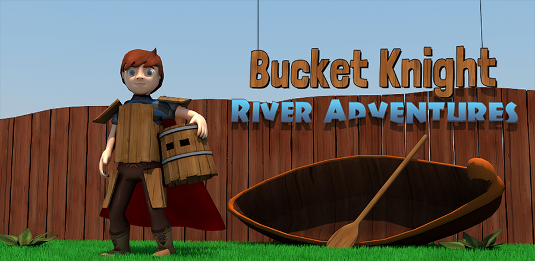

# Bucket Knight: River Adventures
Bucket Knight: River Adventures is an endless rafting mobile game created in [Unity](https://unity.com/) by a team of interns at [Trollpants Game Studio](https://github.com/Trollpants) in 2015.

## Release History
Bucket Knight: River Adventures was released on Google Play, Apple App Store and Amazon Appstore on May 13th, 2015.

## CloudOnce
[CloudOnce](https://github.com/CloudOnce) was used to implement [Google Play Game Services](https://developers.google.com/games/services/) and [Apple Game Center](https://developer.apple.com/game-center/).

## License
The contents of this project is licensed under the MIT license, unless other is specified in file header. See [LICENSE file](./LICENSE) in the project root for full license information.
